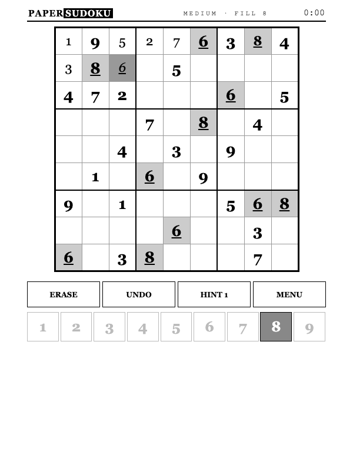

# PaperSudoku

Offline sudoku with unlimited unique puzzles, designed for Kindle e-ink browsers.

<p align="center">
  
</p>

## What it is

A self-contained sudoku game with its own solver, puzzle generator, and
interface. One page, one screen, no scrolling, no network calls — everything
runs locally in the browser.

Every game is generated on the device at the moment you press NEW GAME.
Each puzzle is guaranteed to have exactly one solution, and the app keeps a
history of every puzzle it has ever served you — you never play the same
game twice.

## Kindle-first design

- **ES5, zero dependencies** — runs on old WebKit
- **Unlimited puzzles** — generated locally, uniqueness-checked cell by cell
- **Never repeats** — every served puzzle is hashed and remembered (up to 500)
- **Two screens** — dedicated setup and zero-scroll play screens
- **Partial repaints** — only changed cells redraw after each move
- **Lazy clock** — no per-second repaints; e-ink friendly
- **Big targets** — whole cell is the tap area, with 44px+ buttons
- **Auto-fit** — board sizes to the viewport on load and resize
- **Autosave** — game state and stats use guarded localStorage for Kindle
  firmware compatibility

## Difficulty

| Level  | Clues | Hints |
|--------|-------|-------|
| Easy   | ~40   | 3     |
| Medium | ~32   | 2     |
| Hard   | ~28   | 1     |
| Expert | ~25   | 0 — and no candidate dimming |

## Play

Two ways to enter numbers, whichever hand-position suits you:

- **Number first** — tap a digit (it stays selected), then tap every cell it
  belongs in; tap the digit again to release it
- **Cell first** — tap a cell, then a digit

- Tap a placed number again to erase it
- Selecting a cell dims digits that conflict with its row, column, or box
  (all levels except Expert)
- Same-number highlighting: selecting a number or cell highlights its twins
- UNDO steps back through moves and hints
- HINT reveals one cell from the unique solution (budget per level above)
- MENU → CHECK flags wrong entries until fixed
- Solved grid ends the game: time + hints shown; best time per difficulty kept

## Architecture

- [`index.html`](index.html) — application entry point
- [`js/solver.js`](js/solver.js) — bitmask backtracking solver with solution counting
- [`js/generator.js`](js/generator.js) — random grid fill, symmetric uniqueness-gated digging, no-repeat hashes
- [`js/app.js`](js/app.js) — interface and game flow
- [`css/papersudoku.css`](css/papersudoku.css) — Kindle-first presentation
- [`tests/`](tests/) — node scripts: solver sanity + 400-puzzle generation suite

```bash
node tests/solver.js     # solver correctness
node tests/generator.js  # 100 puzzles per level: valid, unique, in band, distinct
./serve.sh               # LAN serve for Kindle
```

## Contributing

Issues and pull requests are welcome. Keep changes dependency-free, compatible
with ES5-era WebKit, and usable on slow grayscale e-ink displays.

## License

PaperSudoku is available under the [MIT License](LICENSE).

---

Made by [8ugust.dev](https://8ugust.dev)
